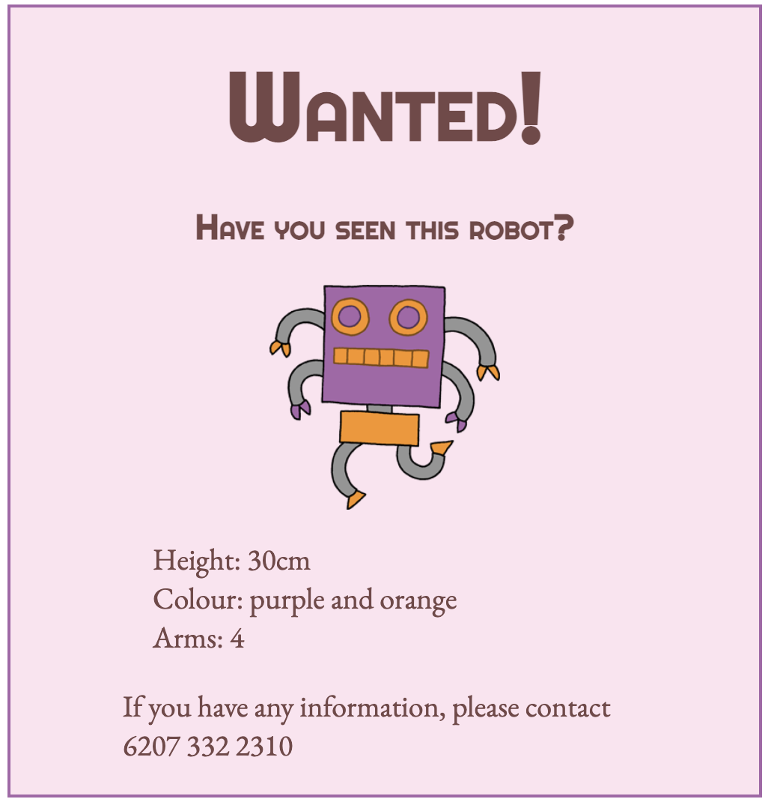

# Wanted Poster

This plain HTML poster is too boring. No one will help us find the robot, unless we improve the poster with _Web Design_.

Bring different pieces of Web Design knowledge together to style a Wanted Poster.

## Instructions

Edit the `style.css` file to style the poster. Try not to make changes to `index.html`. (Adding `<link>s` to fonts is okay).

* Style the text. Choose the font and size for the headings and paragraphs, and whatever font-variant or text decoration you like.
* Using the box model, change the spacing around the image and text as needed.
* If desired, lay out the items differently on the page. Move the poster's container to give it some space, or change its size.
* Choose different colors and apply them to the background and text.

**Be creative!** You don't have to use the same styles as anyone else.

Here's an example of a completed poster:

### Attribution

This exercise was adapted from a similar exercise from the [Replit Curriculum Hub](https://replit.com/curriculum/Intro-to-HTML-and-CSS). Thanks Replit!